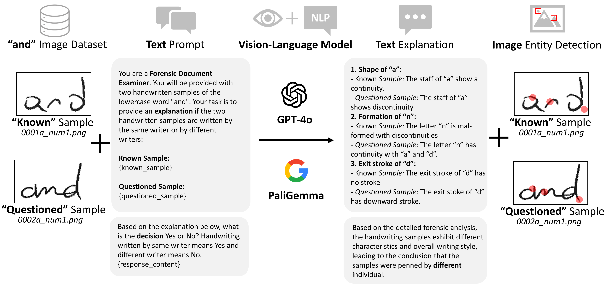
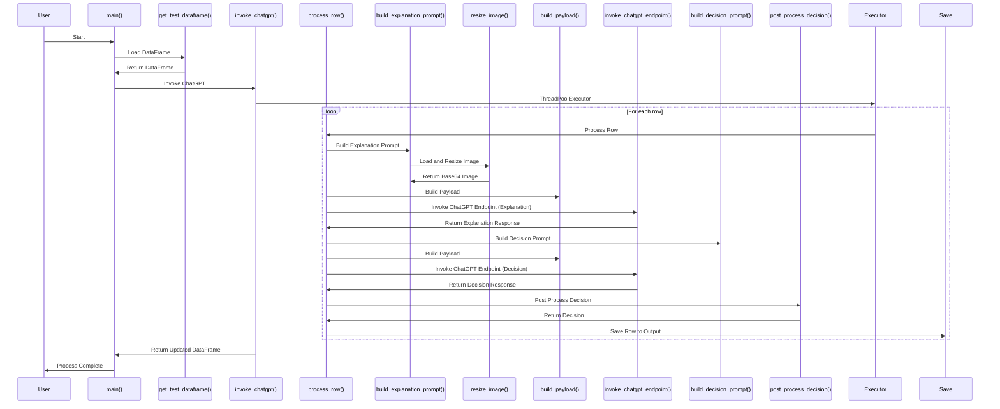

# VLM-HV : Vision-Language Model Based Handwriting Verification

This repository provides implemantation of the experiments descibed in the paper VLM-HV : Vision-Language Model Based Handwriting Verification

Authors: _Mihir Chauhan, Abhishek Satbhai, Mohammad Abuzar Shaikh, Mir Basheer Ali, Bina Ramamurthy, Mingchen Gao, Siwei Lyu and Sargur Srihari_

## CEDAR Handwriting Dataset
| Dataset | Link to Drive |
|:-----------|:------------:|
| CEDAR Letter Images | [Link](https://drive.google.com/drive/folders/1fwRlwtfzV_5Pnyxm9ahQLi2eum2rDshk?usp=sharing)  |
| CEDAR AND Images| [Link](https://drive.google.com/drive/folders/1uj6eeaKBmabivxvRqrGokrcCb3B9yAHu?usp=sharing)  |

## SSL-HV Approach


### Sequence Diagram of the code flow 



## Cite
[VLM-HV paper]() (Accepted as short paper in [IMVIP](https://www.imvip.ie/) Proceedings Aug, 2024)
```
Upcoming
```
