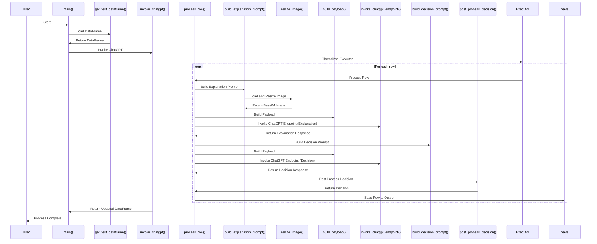

# VLM-HV : Vision-Language Model Based Handwriting Verification

This repository provides ChatGPT implementation as descibed in the paper VLM-HV : Vision-Language Model Based Handwriting Verification

Author : Mihir chauhan, Abhishek Satbhai

### Sequence Diagram of the code flow 

### Cite 
